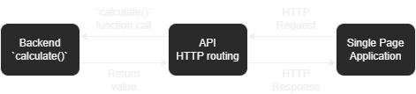

# Stage 2

#### 4

#### 5
See `src/main/kotlin/com/example/api/plugins/Routing.kt`

#### 6
In cases of unexpected requests, the server should send an error response. Clients should handle that case and not crash. 

#### 7
Encrypting the data and using secure network connections and protocols (HTTPS, etc.) should improve data security.

#### 8
Caching responses should improve efficiency in cases where the same parameters are given multiple times.

#### 9
Adding more threads to the server would allow the server to process more requests at the same time.
Sharding the server would also allow processing more requests concurrently.
Using coroutines / suspending operations rather than blocking would also increase efficiency. (Ktor, the framework used here, uses coroutines by default.) 
